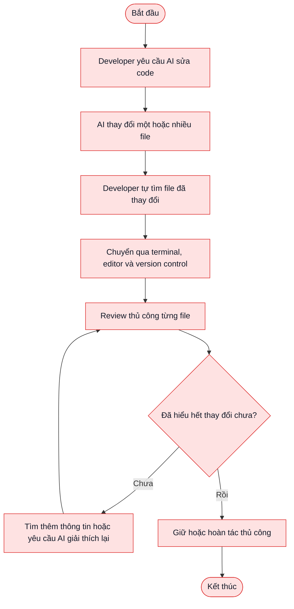
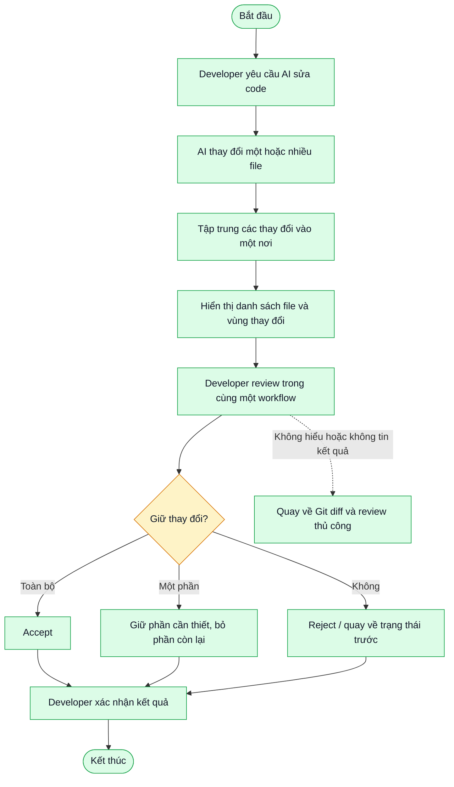
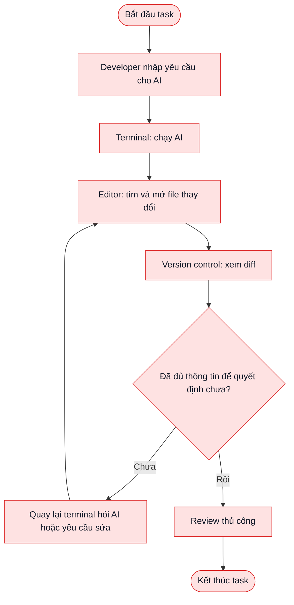
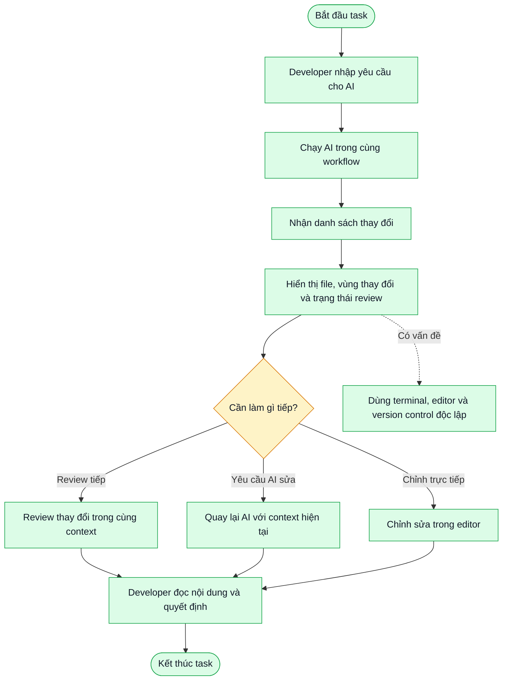
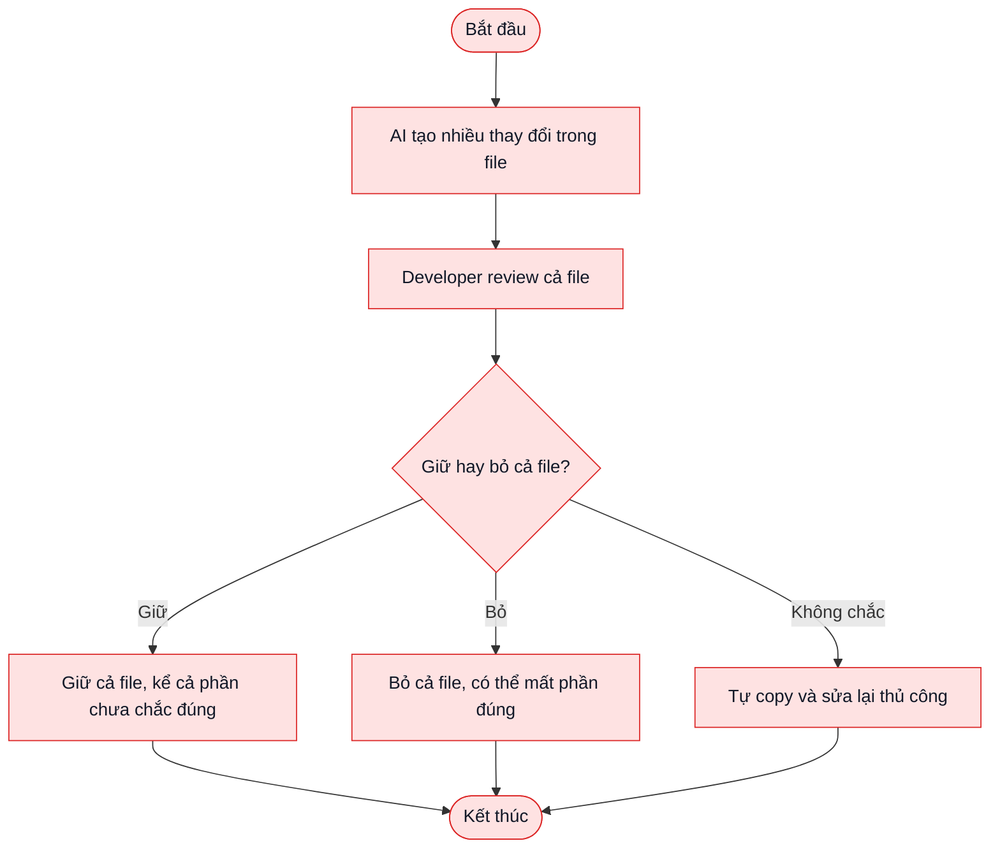
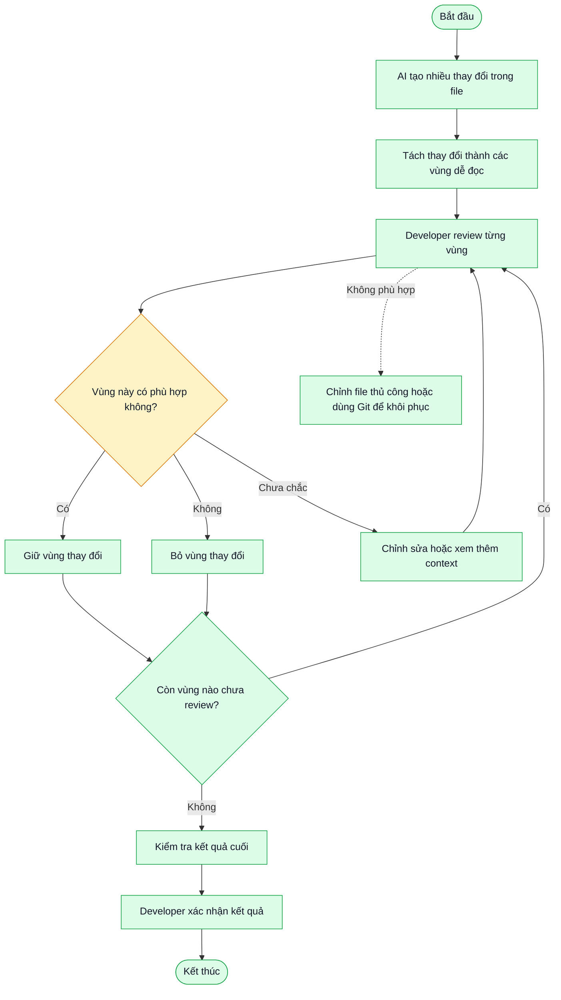

# 01 — Individual Problem Scan

> Bài phân tích ở giai đoạn ý tưởng sản phẩm. Nội dung tập trung vào người dùng,
> pain point, workflow và giá trị nghiệp vụ; chưa phân tích code hoặc quyết định
> cách triển khai kỹ thuật.

## Thông tin cá nhân

- Họ và tên: Vũ Đình Đăng
- Mã học viên: 2A202602946
- Vai trò / bối cảnh: Người phát triển ý tưởng sản phẩm hỗ trợ lập trình viên dùng AI CLI.
- Sản phẩm đang phân tích: AI CLI Diff View — không gian review các thay đổi do AI tạo ra ngay trong VS Code.
- Công việc hằng tuần để soi problem:
  - Dùng AI để hỗ trợ viết hoặc chỉnh sửa code.
  - Theo dõi những gì AI đã thay đổi trong dự án.
  - Kiểm tra, chỉnh sửa, giữ hoặc hoàn tác kết quả do AI đề xuất.
  - Làm việc với nhiều file và nhiều phiên AI trong cùng một dự án.

---

## Phase 1 — Scan 5+ problems

| # | Lăng kính | Problem quan sát được | Ai chịu ảnh hưởng? | Dấu hiệu thật / giả thuyết cần kiểm chứng |
|---|---|---|---|---|
| 1 | Tốn thời gian | Lập trình viên dùng AI để sửa code nhưng phải tự tìm xem AI đã thay đổi những file nào và thay đổi ở đâu. | Developer cá nhân, developer trong team nhỏ. | Mỗi lần AI xử lý nhiều file, người dùng phải kiểm tra từng file bằng công cụ khác nhau. Cần phỏng vấn 5 developer để đo thời gian tìm thay đổi sau một phiên AI. |
| 2 | Pain từ người khác | Người dùng không hoàn toàn tin tưởng output của AI vì không biết phần nào nên giữ, phần nào nên bỏ. | Developer mới dùng AI coding tool hoặc developer làm việc với code quan trọng. | Nỗi lo phổ biến là AI sửa nhầm logic, tạo thay đổi ngoài yêu cầu hoặc làm hỏng phần đang chạy. Cần hỏi người dùng về những lần họ phải hoàn tác output của AI. |
| 3 | Lặp lại | Sau mỗi lần AI chỉnh sửa, developer đều phải thực hiện lại quy trình đọc diff, kiểm tra và quyết định accept/reject. | Mọi developer dùng AI CLI thường xuyên. | Đây là workflow lặp lại theo từng phiên AI. Có thể đo số lần review trong một ngày/tuần và thời gian trung bình mỗi lần. |
| 4 | Tốn thời gian | Việc review bị chia nhỏ giữa cửa sổ terminal nơi chạy AI và trình soạn thảo nơi đọc code. | Developer dùng AI CLI bên ngoài IDE hoặc dùng nhiều công cụ cùng lúc. | Người dùng phải chuyển ngữ cảnh giữa terminal, editor và công cụ version control. Cần đo số lần chuyển cửa sổ và thời gian hoàn thành một lượt review. |
| 5 | AI có thể tốt hơn | Developer muốn chỉ chấp nhận một phần thay đổi của AI thay vì chấp nhận hoặc hoàn tác cả file. | Developer thường yêu cầu AI sửa nhiều phần trong cùng một file. | Một file có thể chứa cả thay đổi đúng và thay đổi cần sửa lại. Cần kiểm chứng tần suất người dùng chỉ muốn giữ một phần output. |
| 6 | Tốn thời gian / Rủi ro | Khi AI thay đổi nhiều file, developer khó có cái nhìn tổng quan về phạm vi thay đổi trước khi quyết định giữ kết quả. | Developer làm dự án vừa/lớn hoặc làm việc theo team. | Nếu không biết có bao nhiêu file bị ảnh hưởng, người dùng dễ review thiếu hoặc mất nhiều thời gian mở từng file. Cần đo số file trung bình trong một phiên AI và tỷ lệ file bị bỏ sót. |
| 7 | Pain từ người khác | Khi AI tạo ra kết quả không mong muốn, người dùng muốn quay lại trạng thái trước đó một cách an toàn và nhanh chóng. | Developer mới dùng AI hoặc làm việc với repository quan trọng. | Nếu rollback không rõ ràng, người dùng phải tự sửa lại hoặc dùng Git thủ công. Cần hỏi về các tình huống người dùng mất thời gian khôi phục thay đổi AI. |
| 8 | AI có thể tốt hơn / Tốn thời gian | Team thiếu một cách review thống nhất đối với thay đổi do AI tạo ra, nên mỗi người tự dùng một quy trình khác nhau. | Team phát triển phần mềm, tech lead, người review code. | Quy trình review không thống nhất gây khó onboarding và khó kiểm soát chất lượng. Cần phỏng vấn một team nhỏ về quy định review AI hiện tại. |

### Giả định nghiệp vụ ban đầu

- Người dùng mục tiêu là developer đã sử dụng AI CLI để chỉnh sửa code.
- Pain chính không phải là “AI không viết được code”, mà là người dùng thiếu cảm giác kiểm soát và thiếu một quy trình review rõ ràng.
- Sản phẩm có giá trị nếu giúp người dùng nhìn thấy phạm vi thay đổi, hiểu thay đổi và quyết định giữ/bỏ nhanh hơn.
- Đây là bài toán cần human-in-the-loop: sản phẩm hỗ trợ review, không tự quyết định thay developer.

### Self-check Phase 1

- [x] Có 8 problems, nhiều hơn yêu cầu tối thiểu 5.
- [x] Các problem đều gắn với người dùng và workflow nghiệp vụ.
- [x] Dùng đủ các lăng kính: lặp lại, tốn thời gian, AI có thể tốt hơn, pain từ người khác.
- [x] Các con số chưa có dữ liệu thực tế đều được ghi là giả thuyết cần kiểm chứng.

---

## Phase 2 — Top 3 Problem Cards

### 2.1. Chọn top 3

| Rank | Problem | Vì sao chọn | Điều còn chưa chắc |
|---|---|---|---|
| 1 | Developer khó biết và kiểm soát đầy đủ những thay đổi do AI tạo ra. | Đây là pain cốt lõi, ảnh hưởng trực tiếp đến niềm tin và quyết định tiếp tục sử dụng AI coding tool. Actor và workflow rõ. | Cần đo mức độ thường xuyên người dùng bỏ sót thay đổi hoặc không dám dùng AI vì lo mất kiểm soát. |
| 2 | Quy trình review AI bị phân tán giữa terminal, editor và version control. | Pain xảy ra lặp lại sau mỗi phiên AI, có thể đo bằng thời gian review và số lần chuyển ngữ cảnh. | Chưa biết người dùng xem đây là vấn đề lớn đến mức nào so với các pain khác trong coding. |
| 3 | Người dùng không thể linh hoạt giữ một phần và bỏ một phần output của AI. | Đây là nhu cầu cụ thể, dễ mô tả, dễ kiểm chứng và tạo ra giá trị rõ trong workflow review. | Cần biết người dùng thường review theo đoạn thay đổi, theo file hay chỉ cần hoàn tác toàn bộ. |

---

### 2.2. Problem Card #1 — Thiếu kiểm soát với thay đổi do AI tạo ra

```text
Problem 1 câu:
Developer dùng AI để chỉnh sửa code nhưng khó biết đầy đủ AI đã thay đổi gì và
không có cảm giác kiểm soát trước khi đưa các thay đổi đó vào dự án.

Actor:
Developer sử dụng AI CLI để viết, sửa hoặc refactor code.

Thời điểm / bối cảnh:
Sau khi AI hoàn thành một yêu cầu có thể tác động đến một hoặc nhiều file.

Current workflow 3-7 bước:
1. Developer mô tả yêu cầu cho AI.
2. AI chỉnh sửa code trong project.
3. Developer tự tìm các file đã bị thay đổi.
4. Developer mở từng file hoặc dùng version control để xem diff.
5. Developer cố gắng hiểu thay đổi nào liên quan đến yêu cầu.
6. Developer quyết định giữ, sửa tiếp hoặc hoàn tác.

Bottleneck:
Không có một nơi tập trung để xem toàn bộ phạm vi thay đổi và kiểm tra từng phần.

Impact:
Developer có thể bỏ sót thay đổi ngoài ý muốn, mất niềm tin vào AI hoặc phải tự
kiểm tra thủ công rất lâu trước khi dám dùng kết quả.

Success metric:
- Ít nhất 5/6 developer phỏng vấn nói rằng họ nhìn thấy rõ toàn bộ phạm vi thay đổi.
- Thời gian từ khi AI hoàn thành đến khi người dùng bắt đầu review giảm ít nhất 30%.
- 0 thay đổi ngoài phạm vi yêu cầu bị chấp nhận mà người dùng không nhận biết trong
  một pilot 10 phiên.
Các số này là mục tiêu kiểm chứng, chưa phải kết quả đã đo.

Non-AI alternative:
Dùng Git diff, checklist review thủ công và quy trình pull request.

AI hypothesis:
Không cần Agent tự quyết định. Sản phẩm nên tạo một workflow review minh bạch,
giúp con người xem và quyết định thay đổi nào được giữ lại.

Quick gut:
[ ] No AI / process fix
[ ] Rule
[x] Workflow
[ ] Agent
[ ] Chưa biết
```

**Draft workflow Card #1**

**Current activity diagram**



**Proposed activity diagram**



---

### 2.3. Problem Card #2 — Quy trình review bị phân tán

```text
Problem 1 câu:
Developer phải chuyển qua lại giữa terminal, editor và version control để review
output của AI, làm mất ngữ cảnh và kéo dài thời gian hoàn thành task.

Actor:
Developer dùng AI CLI bên ngoài hoặc song song với VS Code.

Thời điểm / bối cảnh:
Sau mỗi lượt AI thực hiện thay đổi trên project.

Current workflow 3-7 bước:
1. Mở terminal và nhập yêu cầu cho AI.
2. Chờ AI xử lý và thay đổi file.
3. Chuyển về editor để tìm file liên quan.
4. Mở công cụ diff/version control.
5. Đọc thay đổi rồi quay lại terminal nếu cần yêu cầu AI sửa tiếp.
6. Lặp lại chu trình.

Bottleneck:
Chuyển ngữ cảnh và tìm lại đúng file/vùng code sau mỗi lượt AI.

Impact:
Tăng thời gian hoàn thành task, làm gián đoạn mạch suy nghĩ và khiến developer
khó theo dõi AI đã làm đến đâu.

Success metric:
- Giảm ít nhất 30% số lần chuyển giữa terminal và editor trong một phiên task.
- Giảm ít nhất 25% thời gian review so với workflow hiện tại.
- 4/5 người dùng thử đánh giá workflow mới dễ theo dõi hơn workflow cũ.
Các số này là target pilot, chưa có dữ liệu baseline.

Non-AI alternative:
Viết checklist các file cần review hoặc dùng một tài liệu ghi chú trung gian.
Cách này không giải quyết việc đồng bộ trạng thái thay đổi theo thời gian thực.

AI hypothesis:
AI chỉ tạo ra thay đổi; sản phẩm tập trung hóa workflow review. Không cần để Agent
tự điều hướng hay tự ra quyết định thay người dùng.

Quick gut:
[ ] No AI / process fix
[ ] Rule
[x] Workflow
[ ] Agent
[ ] Chưa biết
```

**Draft workflow Card #2**

**Current activity diagram**



**Proposed activity diagram**



---

### 2.4. Problem Card #3 — Không thể giữ/bỏ linh hoạt từng phần

```text
Problem 1 câu:
Khi AI tạo ra nhiều thay đổi trong cùng một file, developer không có cách đơn giản
để giữ phần đúng và bỏ phần sai mà không phải tự sửa lại thủ công.

Actor:
Developer review output của AI sau một yêu cầu chỉnh sửa code.

Thời điểm / bối cảnh:
AI tạo ra nhiều đoạn thay đổi, trong đó chỉ một phần phù hợp với yêu cầu.

Current workflow 3-7 bước:
1. AI tạo thay đổi trong file.
2. Developer đọc toàn bộ thay đổi.
3. Developer nhận ra một số đoạn đúng, một số đoạn chưa phù hợp.
4. Nếu chỉ có lựa chọn giữ/bỏ cả file, developer phải chọn phương án gần đúng.
5. Developer tự sửa lại hoặc copy thủ công phần muốn giữ.

Bottleneck:
Quyết định giữ/bỏ ở cấp độ quá lớn so với nhu cầu thực tế của developer.

Impact:
Tốn thời gian chỉnh sửa lại, tăng nguy cơ giữ nhầm code hoặc bỏ mất phần đúng.

Success metric:
- Trong pilot, ít nhất 70% người dùng có thể xử lý một thay đổi một phần mà không
  cần copy thủ công sang file khác.
- Giảm ít nhất 30% thời gian chỉnh sửa lại sau khi review output AI.
- Tỷ lệ người dùng nói “tôi kiểm soát được phần được giữ lại” đạt ít nhất 4/5.
Đây là mục tiêu cần kiểm chứng với người dùng.

Non-AI alternative:
Developer tự chỉnh file, dùng Git để hoàn tác rồi áp dụng lại phần cần giữ, hoặc
copy từng đoạn code bằng tay.

AI hypothesis:
Không cần Agent. Một workflow review theo từng vùng thay đổi là đủ; AI không nên
tự quyết định vùng nào đúng thay người dùng.

Quick gut:
[ ] No AI / process fix
[x] Rule
[x] Workflow
[ ] Agent
[ ] Chưa biết
```

**Draft workflow Card #3**

**Current activity diagram**



**Proposed activity diagram**



---

### 2.5. Card muốn pitch nhất

**Card tôi muốn pitch nhất:** Problem Card #1 — Developer thiếu kiểm soát với thay đổi do AI tạo ra.

**Vì sao:** Đây là pain ở cấp độ nhu cầu người dùng, không phụ thuộc vào một công nghệ
cụ thể. Nếu developer không biết AI đã thay đổi gì hoặc không dám giữ output, họ sẽ
không sử dụng AI thường xuyên dù AI có thể giúp viết code nhanh hơn. Sản phẩm nên giải
quyết niềm tin và khả năng kiểm soát trước, rồi mới bàn đến tính năng kỹ thuật.

**Câu hỏi muốn nhóm challenge:**

1. Người dùng thật sự đau ở việc không nhìn thấy thay đổi, hay đau hơn ở việc không biết thay đổi đó có đúng hay không?
2. Nếu đã có Git diff, sản phẩm mới cần tạo thêm giá trị gì để người dùng sẵn sàng dùng một workflow riêng?

**AI phản biện Card:**

- Điểm yếu AI chỉ ra: problem vẫn có nguy cơ quá rộng nếu chỉ nói “tăng niềm tin vào AI”; cần giới hạn vào workflow sau khi AI sửa file và quyết định giữ/bỏ thay đổi.
- Tôi sửa: xác định rõ actor, thời điểm, các bước hiện tại, bottleneck và metric pilot; không đưa “AI tự review thay người” vào phạm vi sản phẩm.

### Self-check nộp phần 01

- [x] Có 8 problems và top 3 Problem Cards đủ field.
- [x] Mỗi Card có workflow trước/sau, bottleneck, metric và fallback.
- [x] Đã chọn 1 card pitch và có câu hỏi challenge.
- [x] Phân tích ở cấp độ nghiệp vụ/sản phẩm, chưa đi vào code hoặc implementation.
